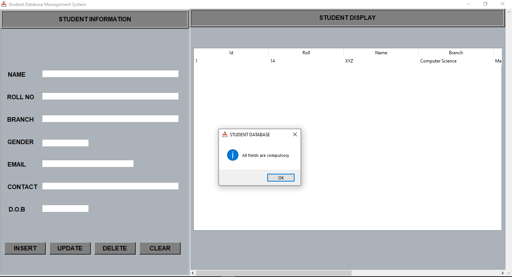

# Student Database Management System. :books:
> Hey viewers :smiley:

This GUI is developed for Student Data Management which can store, update, read and delete your entered data. All these operations are performed and stored by the backend code in the database.
The frontend code provides a awsome 'graphical user interface' to access the students records and to manage them without bothering about other technicalities.
#### Languages and Tools used 🔧 :
- Python.
- sqlite.
- pycharm.
- sqlite browser(DB browser).
## Installations :open_file_folder:

#### Install python according to your OS.
[Python Download](https://www.python.org/downloads/)
#### You can use any IDE (I personally used Pycharm for this project.)
[Pycharm download](https://www.jetbrains.com/pycharm/download/#section=windows)
#### Install sqlite browser according to your OS.
[Sqlite browser download](https://sqlitebrowser.org/dl/)
#### Install git according to your OS.
[Git download](https://git-scm.com/downloads)

## Getting started :clipboard:
- First install all the essentials mentioned above.
- Open your git bash terminal and copy paste below code.
  ```
  cd name_of_folder_to_copy
  git clone https://github.com/MaiShantanuHU/Student-Database-Management-System.git
  ```
  - The above line of code first opens a folder you want and then clone the files of this repository into the folder.

- Now open those files in any IDE.
- Now you have created a database with the same name as mentioned in backend code i.e 'studentrecord'.
  - You can add the below code to 'final_backend.py' file to create a database.
    ```
    # Connecting to sqlite
    conn = sqlite3.connect('studentrecord.db')
    # Creating a cursor object using the cursor() method
    cursor = conn.cursor()
    # Creating table as per requirement
    sql ='''CREATE TABLE studentrecord(
      id	INTEGER,
	  PRIMARY KEY(id),
      StdID text,
      Name text,
      Branch text,
      Gender text,
      DoB text,
      Mobile text,
      Email text
    )'''
    # Creating table as per requirement
    cursor.execute(sql)
    print("Table created successfully........")
    # Commit your changes in the database
    conn.commit()
    # Closing the connection
    conn.close()
    ```
  - Or you can create database with name 'studentrecord' directly from sqlite browser. [Refer](https://youtu.be/YLOZpYAYPLQ)
- Note keep all the files in same folder.
- Also download the logo given in repo and keep in same folder.
  ```
  root.iconbitmap(r'logo.ico')
  ```
  - Here you need that logo in fronend.py file.
  - If you want your own logo then store that in same folder and just change name of file in above code.
  - Note the logo should have .ico extenstion only.
  
## Output :computer:



## Links :link:

- Repository: https://github.com/MaiShantanuHU/Student-Database-Management-System
  - In case of sensitive bugs like security vulnerabilities, please contact
    shantanujc@gmail.com directly instead of using issue tracker. We value your effort
    to improve the security and privacy of this project!
- Other projects:
  - My other project: https://github.com/MaiShantanuHu/Covid19-Data-Analysis.git
  
## Licensing ⚖️ 

"The code in this project is licensed under MIT license."
